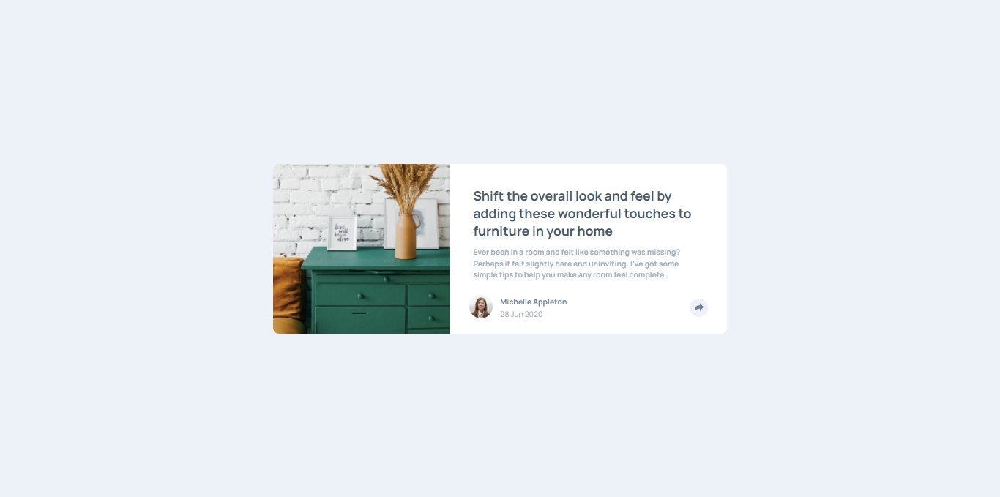

# Frontend Mentor - Article preview component solution

This is a solution to the [Article preview component challenge on Frontend Mentor](https://www.frontendmentor.io/challenges/article-preview-component-dYBN_pYFT). Frontend Mentor challenges help you improve your coding skills by building realistic projects. 

## Table of contents

- [Overview](#overview)
  - [The challenge](#the-challenge)
  - [Screenshot](#screenshot)
  - [Links](#links)
- [My process](#my-process)
  - [Built with](#built-with)
  - [What I learned](#what-i-learned)
  - [Continued development](#continued-development)
  - [Useful resources](#useful-resources)
- [Author](#author)
- [Acknowledgments](#acknowledgments)

## Overview

### The challenge

Users should be able to:

- View the optimal layout for the component depending on their device's screen size
- See the social media share links when they click the share icon

### Screenshot



### Links

- Solution URL: [GitHub Pages](https://github.com/manuelcardoso5005/article-preview-component-master?tab=readme-ov-file)
- Live Site URL: [Vercel](https://article-preview-component-master-ten-iota.vercel.app/)

## My process

### Built with

- Semantic HTML5 markup
- CSS custom properties
- Flexbox
- Media Queries for responsive design
- Font Awesome for icons
- JavaScript for interactive functionality

### What I learned

Working on this project, I learned several key concepts and techniques that were essential for developing the solution:

- Semantic HTML5 Markup:
Using semantic tags like <main>, <figure>, and <header> to improve accessibility and SEO of the page.

```html
<figure class="drawers">
    
</figure>
```

- CSS Custom Properties (CSS Variables):
Using CSS variables to maintain color consistency and facilitate code maintenance.

```css
:root {
    --very-dark-grayish-blue: hsl(217, 19%, 35%);
    --desaturated-dark-blue: hsl(214, 17%, 51%);
    --grayish-blue: hsl(212, 23%, 69%);
    --light-grayish-blue: hsl(210, 46%, 95%);
}
```

- Flexbox for Responsive Layouts:
Utilizing Flexbox to create responsive layouts and align elements.

```css
.panel-bottom {
    display: flex;
    align-items: center;
    justify-content: space-between;
}
```

- DOM Manipulation with JavaScript:
Adding and removing classes to manipulate the state of elements and user interactions.

```js
btnShare.addEventListener('click', () => {
    btnShare.classList.toggle('active');
    if (btnShare.classList.contains('active')) {
        sharePanel.classList.remove('hide');
        pannelBottom.classList.add('activeBottom');
        userImage.classList.add('hide-data');
        aboutUser.classList.add('hide-data');
        iconShare.classList.add('activeShare');
    } else {
        sharePanel.classList.add('hide');
        pannelBottom.classList.remove('activeBottom');
        userImage.classList.remove('hide-data');
        aboutUser.classList.remove('hide-data');
        iconShare.classList.remove('activeShare');
    }
});
```

- CSS Transformations and Pseudo-elements:
Creating custom shapes, like a diamond (rhombus), using transformations and pseudo-elements.

```css
.losango {
    width: 20px;
    height: 20px;
    background-color: var(--very-dark-grayish-blue);
    transform: rotate(45deg);
    position: absolute;
    top: -6px;
    left: 115px;
}
```

### Continued development

In future projects, I want to continue focusing on the following areas:

1. **Advanced CSS Techniques**:
   I aim to deepen my understanding and mastery of advanced CSS concepts such as animations, transitions, and CSS Grid. I plan to explore more complex layouts and interactions to create more engaging user experiences.

2. **JavaScript Interactivity**:
   While I have implemented basic DOM manipulation, I want to enhance my skills in JavaScript, particularly in areas such as event handling, asynchronous programming, and working with APIs. This will allow me to build more dynamic and responsive web applications.

3. **Responsive Design Best Practices**:
   Continuing to improve my approach to responsive design is crucial. I want to refine my techniques for ensuring that web applications are fully functional and aesthetically pleasing on all devices, using a mobile-first approach and testing across various screen sizes.

4. **Accessibility**:
   Making my projects accessible to all users is a priority. I will focus on learning more about ARIA roles, keyboard navigation, and other accessibility best practices to ensure that my websites are usable by people with disabilities.

5. **Performance Optimization**:
   I plan to explore techniques for optimizing web performance, including lazy loading, code splitting, and minimizing render-blocking resources. This will help in delivering faster, more efficient web applications.

By focusing on these areas, I hope to enhance my development skills and deliver higher quality projects in the future.

### Useful resources

- [MDN Web Docs](https://developer.mozilla.org/en-US/) - A comprehensive resource for HTML, CSS, and JavaScript documentation. It's my go-to place for understanding web technologies.
- [CSS-Tricks](https://css-tricks.com/) - A fantastic website with articles, guides, and code snippets for CSS. It has helped me learn advanced CSS techniques and solve specific layout challenges.
- [JavaScript.info](https://javascript.info/) - An excellent resource for learning JavaScript from basics to advanced topics. It provides clear explanations and interactive examples.
- [A11y Project](https://www.a11yproject.com/) - A valuable resource for accessibility best practices and guidelines. It helped me understand how to make my projects more inclusive.
- [Web.dev](https://web.dev/) - Google's resource for web developers, offering insights and tools to improve web performance and user experience.

These resources have been instrumental in my learning journey and have provided valuable insights that enhanced my development skills.

## Author

- Frontend Mentor - [@manuelcardoso5005](https://www.frontendmentor.io/profile/manuelcardoso5005)
- Linkedin - [@manuelcardoso5005](https://www.linkedin.com/in/manuelcardoso5005/)

## Acknowledgments

I would like to give a special thanks to the following:

- **Frontend Mentor**: For providing the challenge and resources that helped me improve my front-end skills.
- **MDN Web Docs**: For their extensive documentation and examples that were invaluable during the development of this project.
- **CSS-Tricks**: For their detailed articles and guides on CSS that helped me tackle complex styling issues.
- **JavaScript.info**: For their clear explanations and tutorials that assisted me in enhancing my JavaScript skills.
- **My peers and mentors**: For their feedback and encouragement throughout the project. Their insights were instrumental in refining my work.

Thank you all for your support and inspiration!